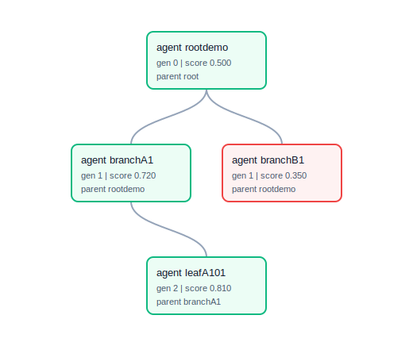

# Darwin Gödel Machine

**A Self-Improving AI System for Evolutionary Code Enhancement**

[](https://github.com/lemoz/darwin-godel-machine)
[](https://github.com/lemoz/darwin-godel-machine/actions/workflows/ci.yml)


## 🧬 Overview

The Darwin Gödel Machine (DGM) is an innovative implementation of self-improving AI agents that iteratively modify their own Python codebase to enhance their coding capabilities. Unlike traditional approaches that rely on formal proofs, DGM uses empirical validation through coding benchmarks to drive evolutionary improvement.

Based on the research paper **"Darwin Gödel Machine: Open-Ended Evolution of Self-Improving Agents"** ([arXiv:2505.22954](https://arxiv.org/abs/2505.22954)), this implementation demonstrates how AI systems can achieve self-referential self-improvement through population-based exploration and empirical validation.

For more details, see the [official blog post](https://sakana.ai/dgm/) from Sakana AI.

### 🔑 Key Features

- **🔄 Self-Referential Self-Improvement**: Agents modify their own source code to improve performance
- **📊 Empirical Validation**: Changes validated through coding benchmarks rather than formal proofs
- **🏗️ Population-Based Evolution**: Maintains archive of all valid agents for diverse exploration
- **🤖 Foundation Model Integration**: Supports Claude, Gemini, and OpenAI models
- **🛠️ Tool-Equipped Agents**: Agents use Bash and file editing tools to solve problems
- **🏪 Agent Archive System**: Stores successful agents with performance and novelty metrics
- **🎯 Benchmark-Driven Evolution**: Uses custom coding challenges to measure improvement
- **🔒 Guarded Execution**: Workspace-scoped file access, command filtering, and hard timeouts with process-group cleanup (Docker isolation is planned, not yet implemented)

## 🚀 Quick Start

### Prerequisites

- Python 3.9+
- API keys for supported Foundation Models (Claude, Gemini, or OpenAI)

### Installation

1. **Clone the repository:**
```bash
git clone https://github.com/lemoz/darwin-godel-machine.git
cd darwin-godel-machine
```

2. **Install dependencies:**
```bash
pip install -r requirements.txt
```

3. **Configure API keys:**
```bash
cp .env.example .env
# Edit .env with your API keys
```

4. **Run the system:**
```bash
python run_dgm.py
```

## 🔧 Configuration

The system uses YAML configuration files to control behavior:

```yaml
# config/dgm_config.yaml
fm_providers:
  primary: anthropic  # or 'gemini', 'openai'
  anthropic:
    model: claude-sonnet-4-6
    api_key: ${ANTHROPIC_API_KEY}
  gemini:
    model: gemini-2.5-flash-preview-05-20
    api_key: ${GEMINI_API_KEY}

dgm_settings:
  max_iterations: 100
  pause_after_iteration: true
  sandbox_timeout: 300

benchmarks:
  enabled:
    - string_manipulation
    - list_processing  
    - simple_algorithm
```

## 🏗️ Architecture

### Core Components

#### 1. **DGM Controller** (`dgm_controller.py`)
Orchestrates the main evolution loop:
- Parent selection from archive
- Self-modification coordination
- Benchmark evaluation
- Archive management

#### 2. **Agent System** (`agent/`)
LLM-powered coding agents with:
- Foundation Model integration
- Tool usage capabilities (Bash, File editing)
- Task solving and self-modification abilities

#### 3. **Archive Management** (`archive/`)
- **Agent Archive**: Stores every valid agent (unbounded, per the paper) with full lineage
- **Parent Selector**: Implements the paper's selection rule — sigmoid-scaled performance times a 1/(1+children) exploration bonus, sampled categorically
- **Lineage Visualization**: Generate an SVG or HTML family tree from archive metadata

```bash
python scripts/generate_archive_lineage.py --archive-dir archive/agents --output docs/archive-lineage.html
```



#### 4. **Evaluation System** (`evaluation/`)
- **Benchmark Runner**: Executes agents on coding challenges
- **Validator**: Ensures agents compile and maintain capabilities
- **Scorer**: Calculates performance metrics

#### 5. **Self-Modification** (`self_modification/`)
- **Diagnosis**: Analyzes agent performance issues
- **Proposal**: Generates improvement suggestions
- **Implementation**: Applies code modifications

## 📚 Memory Bank System

The DGM includes a sophisticated **Memory Bank** system that maintains development context and project knowledge across sessions. This is crucial for understanding the project's evolution and current state.

### Memory Bank Structure

The Memory Bank consists of five core files in the `memory-bank/` directory:

#### 📄 `productContext.md`
- **Purpose**: High-level project overview and goals
- **Contains**: Project description, key features, overall architecture
- **Updated**: When fundamental project aspects change

#### 📊 `activeContext.md`
- **Purpose**: Current project status and immediate context
- **Contains**: 
  - Current focus and priorities
  - Recent changes and progress
  - Open questions and issues
- **Updated**: Frequently during development

#### 🏛️ `systemPatterns.md`
- **Purpose**: Recurring architectural patterns and design standards
- **Contains**: 
  - Coding patterns and conventions
  - Architectural decisions and rationale
  - Testing and validation patterns
- **Updated**: When new patterns emerge or existing ones evolve

#### 📋 `decisionLog.md`
- **Purpose**: Record of significant architectural and implementation decisions
- **Contains**:
  - Decision descriptions with timestamps
  - Rationale and reasoning
  - Implementation details and implications
- **Updated**: When major technical decisions are made

#### ✅ `progress.md`
- **Purpose**: Task tracking and completion status
- **Contains**:
  - Completed tasks with timestamps
  - Current tasks in progress
  - Next steps and planned work
- **Updated**: As tasks are completed or priorities change

### Using the Memory Bank

The Memory Bank serves multiple purposes:

1. **Development Continuity**: Maintains context across development sessions
2. **Decision Tracking**: Records why architectural choices were made
3. **Progress Monitoring**: Tracks project evolution and completion
4. **Knowledge Preservation**: Captures lessons learned and patterns discovered
5. **Collaboration**: Helps team members understand project state and history

When working on the DGM, always consult the Memory Bank to understand current context and update it when making significant changes.

## 🔄 How It Works

### The DGM Evolution Loop

1. **Initialize**: Start with a base agent in the archive
2. **Select Parent**: Choose an agent based on performance and novelty
3. **Self-Modify**: Agent analyzes its performance and proposes improvements
4. **Implement**: Agent modifies its own code based on the proposal
5. **Evaluate**: Test the modified agent on coding benchmarks
6. **Archive**: If valid and performs well, add to the agent archive
7. **Repeat**: Continue the cycle to drive continuous improvement

### Agent Capabilities

Each agent is a complete coding system that can:
- **Solve Coding Problems**: Use LLM reasoning to understand and solve tasks
- **Use Tools**: Execute bash commands and edit files
- **Self-Analyze**: Review its own performance and identify weaknesses
- **Self-Modify**: Propose and implement improvements to its own code
- **Maintain Validity**: Preserve its core capabilities while evolving

### Benchmark Examples

The system includes several coding challenges:

```yaml
# String Manipulation Challenge
name: reverse_with_numbers
description: "Reverse alphabetic characters while keeping numbers in place"
inputs: ["abc123def", "hello5world"]
expected_outputs: ["fed123cba", "dlrow5olleh"]
```

For a harder no-network smoke path, see `config/benchmarks/humaneval_style.yaml`.
It contains HumanEval-style standalone function tasks with reference solutions
verified by the integration test suite; add `humaneval_style` to
`benchmarks.enabled` when you want the DGM loop to evaluate against it.

## 🧪 Running Experiments

### Basic Evolution Run
```bash
# Run with default settings (3 generations)
python run_dgm.py

# Run with custom generation count
python run_dgm.py --generations 10

# Reset system state
python reset_dgm.py
```

### Monitoring Progress
```bash
# View archive contents
ls archive/agents/

# Check evaluation results
ls results/

# Monitor logs
tail -f dgm_run.log
```

### Testing Components
```bash
# Run the full test suite (155 tests, no API keys needed)
python -m pytest

# Test specific components
python -m pytest tests/unit/test_agent.py
python -m pytest tests/integration/   # includes a full no-network DGM generation
```

## 📈 Performance Tracking

The system tracks several metrics:

- **Agent Performance**: Benchmark scores over time
- **Archive Growth**: Number of valid agents discovered
- **Improvement Rate**: Frequency of successful enhancements
- **Diversity Metrics**: Novelty and variation in agent approaches

Results are stored in the `results/` directory with detailed JSON reports.

## 🔒 Safety Features

- **Workspace Containment**: File edits and bash redirects are resolved and confined to the agent's workspace; path-traversal escapes are rejected
- **Command Filtering**: Dangerous commands are blocked before execution
- **Hard Timeouts**: Benchmark and tool subprocesses are killed (entire process group) on timeout
- **Validation Checks**: Modified agents must parse, define a working Agent class, and load before admission to the archive
- **Human Oversight**: Optional pause points for review
- **Comprehensive Logging**: Full audit trail of all changes

> **Note**: execution is guarded but not fully isolated — Docker-based sandboxing is planned (`sandbox/` contains the stub). Run untrusted evolution experiments inside a container or VM.

## 🐛 Troubleshooting

### Common Issues

**API Connection Errors**
```bash
# Verify message formatting and provider config (no network needed)
python -m pytest tests/unit/test_fm_connection.py

# Check rate limits in provider console
```

**Agent Scoring 0.0**
```bash
# Check the benchmark harness end to end
python -m pytest tests/integration/test_benchmark_evaluation.py

# Verify agent code extraction
python -m pytest tests/unit/test_agent_code_extraction.py
```

### Debug Mode
```bash
# Enable verbose logging
export PYTHONPATH=.
python run_dgm.py --log-level DEBUG

# Dump full agent conversations to debug/ (set in config/dgm_config.yaml
# under the active provider): debug_conversation_dump: true
ls debug/conversation_history_*
```

## 🤝 Contributing

We welcome contributions! Please see our contributing guidelines:

1. **Fork the repository**
2. **Read the Memory Bank** to understand current context
3. **Create a feature branch**: `git checkout -b feature/amazing-feature`
4. **Update Memory Bank** when making architectural changes
5. **Add tests** for new functionality
6. **Submit a pull request**

### Development Setup

```bash
# Install dependencies (includes pytest)
pip install -r requirements.txt

# Run tests
python -m pytest

# Update Memory Bank
# Edit memory-bank/*.md files as needed
```

## 📖 Documentation

- **Architecture Overview**: `reference-design/dgm-mvp-architecture.md`
- **FM Integration**: `reference-design/fm-interaction-layer.md`
- **Tool Management**: `reference-design/tool-management.md`
- **Research Paper**: `dgm_research_paper.md`
- **Memory Bank**: `memory-bank/` directory

## 🧬 Research Context

This implementation is based on the research paper "Darwin Gödel Machine: Open-Ended Evolution of Self-Improving Agents" which demonstrates:

- **Performance Improvements**: SWE-bench scores improved from ~20% to ~50%
- **Polyglot Gains**: Performance increased from ~14.2% to ~30.7%
- **Open-Ended Discovery**: Continuous generation of novel agent variants
- **Empirical Validation**: Practical alternative to formal proof requirements

## 📊 Benchmarks and Results

The system has achieved:
- ✅ **Functional Self-Improvement**: Agents successfully modify their own code
- ✅ **Benchmark Performance**: Proper scoring on coding challenges
- ✅ **Population Evolution**: Growing archive of diverse agent variants
- ✅ **Stable Operation**: Reliable execution without infinite loops
- ✅ **Tool Integration**: Effective use of bash and file editing capabilities

## 🔮 Future Enhancements

- **Advanced Benchmarks**: Integration with SWE-bench and HumanEval
- **Multi-Agent Collaboration**: Cooperative improvement strategies
- **Foundation Model Fine-tuning**: Custom model training integration
- **Web Interface**: GUI for monitoring and controlling evolution
- **Advanced Novelty Metrics**: More sophisticated diversity measures
- **Distributed Archive**: Scaling to larger agent populations

## 📄 License

This project is licensed under the MIT License - see the [LICENSE](LICENSE) file for details.

## 🙏 Acknowledgments

- Original DGM research team for the foundational concepts
- Anthropic, Google, and OpenAI for Foundation Model access
- The open-source AI community for tools and inspiration

## 📞 Support

- **Issues**: GitHub Issues tracker
- **Discussions**: GitHub Discussions
- **Documentation**: Check the `docs/` directory and Memory Bank
- **Memory Bank**: Always consult `memory-bank/` for current project context

---

**Ready to evolve some AI? Start with `python run_dgm.py` and watch your agents improve themselves!** 🚀
## 📚 References

### Original Research
- **Paper**: [Darwin Gödel Machine: Open-Ended Evolution of Self-Improving Agents](https://arxiv.org/abs/2505.22954)
- **Authors**: Jenny Zhang, Shengran Hu, Cong Lu, Robert Lange, Jeff Clune (Sakana AI, UBC, Vector Institute)
- **Published**: arXiv:2505.22954 (2025)

### Additional Resources
- **Official Blog Post**: [Sakana AI - Darwin Gödel Machine](https://sakana.ai/dgm/)
- **Implementation**: This repository provides a complete open-source implementation
- **Related Work**: Gödel machine framework and self-improving artificial general intelligence

### Citation
```bibtex
@article{zhang2025darwin,
  title={Darwin G{\"o}del Machine: Open-Ended Evolution of Self-Improving Agents},
  author={Zhang, Jenny and Hu, Shengran and Lu, Cong and Lange, Robert Tjarko and Clune, Jeff},
  journal={arXiv preprint arXiv:2505.22954},
  year={2025}
}
```

---

## 👨‍💻 Author

**Implementation by**: [@cdossman](https://x.com/cdossman)

**Disclaimer**: This is an independent implementation based on the research paper. Not officially affiliated with Sakana AI.
